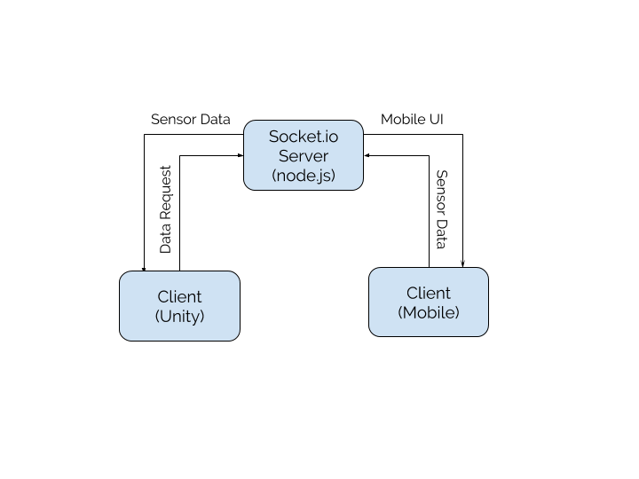

<p  align="center"></p>
<h1 align="center">
  Human-Centered Assistive and Rehabilative Devices
</h1>

<p  align="center">
<sup>
  <a href="https://github.com/pa17">Paolo Rüegg</a>, 
  <a href="https://github.com/emmlub">Emma Lubel</a>, 
  <a href="https://github.com/nzsdejan77">Areg Nzsdejan</a>, 
  <a href="https://github.com/Alissa-1998">Alissa Parmenter</a>, 
  <a href="https://github.com/CharisGeo">Harry Georgiou</a>, 
</sup>
</p>

<p  align="center">
<sup><sup>
  Department of Bioengineering, Mechanical Engineering & Dyson School of Design Engineering, Imperial College London
</sup></sup>
</p>

<!-- <h4 align="center">
  <a href="#">More information coming soon...</a>
  <br><br>
  
</h4> -->

<!-- 
<p align="center">
	<sub>Design Engineering, Imperial College London</sub>
</p>
<br>
<p align="center">
	<a href="https://vimeo.com/291377091" >
	</a>
</h1>
<br>
-->

**Space Race** is a low-cost and easily accessible game that trains posture control and core strength. It is designed specifically for cerebral palsy patients, but can be used by anybody with access to a smartphone and computer. Rather than relying on complex mechatronic systems, SpaceRace uses the motion sensing capabilities in smartphones as a controller. The phone is attached to the player through a harness, which are available for around $20. The goal of the game is to collect  collectables in different levels by steering a marble through tilt and lean movements.  

### Code Structure

- The [Unity development directory](https://github.com/pa17/hcard/hcard_dev/) was used for game development. 
- The [server directory](https://github.com/pa17/hcard/server/) was used to develop a local webserver that delivers sensor data to the Unity client and hosts a controler UI on the smartphone.

### Documentation

Throughout our code we have endeavored to leave useful comments where suitable. In addition, the whole project is including background, aims and clinical relevance are discussed in the [project report](https://github.com/pa17/hcard/projectReport/).

### Repository Structure Tree

*Note: This is a 'light' version of the project structure.*

```
hcard/
    ├── README.md
    ├── hcard_dev
    │   ├── Assets
    │   ├── Data
    │   ├── Library
    │   ├── Logs
    │   ├── Packages
    │   ├── ProjectSettings
    │   ├── README.md
    └── server
        ├── app
        │   ├── app.js
        │   ├── node_modules
        │   ├── public
        │   │   ├── index.html
        │   │   ├── libs
        │   │   ├── settings.json
        │   │   └── sketch.js
        │   └── README.md
        └── package-lock.json
```

### System Overview

The Unity and mobile phone are both clients to a locally hosted webserver, as shown in the figure below. Sensor data informs both a mobile UI on the phone controller as well as the actual game.

<p align="center"></p>

### License

Our source code is licensed under [GNU General Public License v3.0](LICENSE)

<a rel="license" href="http://creativecommons.org/licenses/by-sa/4.0/"></a><br />This work is licensed under a <a rel="license" href="http://creativecommons.org/licenses/by-sa/4.0/">Creative Commons Attribution-ShareAlike 4.0 International License</a>.